# 🚭 LogMySmoke - Quit Smoking Tracker

A modern, feature-rich Flutter application designed to help users track their smoking habits and support their journey to quit smoking. Built with clean architecture principles and BLoC state management.

[](https://play.google.com/store/apps/details?id=com.dakshrachit.quitsmoking)


> **📱 Now Available on Google Play Store!** Download the app and start your quit smoking journey today.

---

## ✨ Features

### 🔐 Authentication & Onboarding
- **Google Sign-In Integration** - Seamless authentication using Firebase Auth
- **Multi-Step Onboarding Flow** - Personalized setup experience with progress tracking
  - Personal motivations collection (minimum 3 required)
  - Daily cigarette intake configuration
  - Pack size and cost tracking
  - Notification preferences
- **First-Time User Detection** - Automatic routing based on onboarding status

### 🏠 Home Dashboard
- **Real-Time Statistics Display**
  - Live counter showing today's cigarette count
  - Time since last cigarette (Year/Month/Day/Hour/Min/Sec)
  - Longest cessation record tracking
  - Money spent vs. money saved calculations
- **Quick Actions**
  - Add cigarette log with single tap (red circular button)
  - Remove last log entry (undo functionality)
  - Responsive floating navigation bar
- **Auto-Updating Timers** - Real-time updates every second
- **Cost Tracking** - Automatic calculation based on pack cost and size

### 📅 History & Analytics
- **Interactive Calendar View** - Visual representation of smoking history
- **Date-Based Filtering** - Select any date to view detailed logs
- **Daily Summary Cards**
  - Total cigarettes smoked per day
  - Clean/Relapse status indicators
- **Chronological Log Display** - Time-stamped entries with sequential numbering
- **Empty State Handling** - Encouraging "Smoke Free Day" messages

### ⚙️ Settings & Preferences
- **Notification Management** - Toggle daily motivational notifications
- **Account Management** - Secure sign-out functionality
- **Version Information** - App version display

### 🔔 Notifications
- **Daily Motivational Messages** - Scheduled reminders to stay motivated
- **Firebase Cloud Messaging** - Push notification support
- **Local Notifications** - Persistent reminders even when offline

### 🌐 Connectivity
- **Offline Support** - Network connectivity detection
- **No Internet Wrapper** - Graceful handling of offline scenarios

---

## 🏗️ Architecture

This application follows **Clean Architecture** principles with **BLoC (Business Logic Component)** pattern for state management.

### Architecture Overview

```mermaid
graph LR
    UI[📱 UI Layer<br/>Screens & Widgets]
    BLoC[🔄 BLoC Layer<br/>State Management]
    Data[💾 Data Layer<br/>Repositories]
    Firebase[🔥 Firebase<br/>Backend Services]
    
    UI <--> BLoC
    BLoC <--> Data
    Data <--> Firebase
    
    style UI fill:#FF6B6B
    style BLoC fill:#4ECDC4
    style Data fill:#95E1D3
    style Firebase fill:#FFA500
```



**Clean Architecture with BLoC Pattern:**
- **UI Layer** - Flutter screens and reusable widgets
- **BLoC Layer** - Business logic and state management (Auth, Home, History)
- **Data Layer** - Repositories and services for data access
- **Firebase** - Cloud Firestore, Authentication, and Cloud Messaging

### Project Structure

```
lib/
├── 🎨 core/              # Shared utilities, theme, routing, widgets
├── 💾 data/              # Models, repositories, services
├── 📱 view/              # UI screens and widgets
├── 🔄 viewmodel/         # BLoC state management (auth, home, history)
├── firebase_options.dart
└── main.dart
```

**Layer Breakdown:**
- **core/** - Router (GoRouter), theme (colors), shared widgets (loader, connectivity)
- **data/** - Models (User, SmokeLog), Repositories (auth, logs, user data), Services (Firebase, notifications)
- **view/** - 6 screens (splash, login, onboarding, home, history, settings)
- **viewmodel/** - 3 BLoCs with events and states (AuthBloc, HomeBloc, HistoryBloc)

---

## 🎨 Design System

### Color Palette
- **Background**: Pure Black (`#000000`)
- **Surface**: Dark Grey (`#151517`)
- **Text**: White (`#FFFFFF`) / Grey (`#8D8D8D`)
- **Accents**:
  - Neon Green: `#3BF37C` (success states)
  - Neon Orange: `#FF7A33` (money spent)
  - Neon Blue: `#47B6FF` (money saved)
  - Red/Pink: Various shades (primary actions, warnings)

### Typography
- **Primary Font**: Poppins (headings, bold text)
- **Secondary Font**: Lato (body text)
- **Monospace Font**: Roboto Mono (numbers, timestamps)

### UI Patterns
- **Glassmorphism** - Subtle borders and shadows
- **Neon Accents** - Glowing effects on interactive elements
- **Dark Mode First** - Optimized for low-light usage
- **Responsive Design** - Adapts to different screen sizes
- **Portrait Lock** - Prevents layout issues on small screens

---

## 🛠️ Tech Stack

### Core Framework
- **Flutter 3.0+** - Cross-platform UI framework
- **Dart SDK** - Programming language

### State Management
- **flutter_bloc (^9.1.1)** - BLoC pattern implementation
- **equatable (^2.0.7)** - Value equality for states/events

### Firebase Services
- **firebase_core (^4.2.0)** - Firebase initialization
- **firebase_auth (^6.1.1)** - User authentication
- **cloud_firestore (^6.0.3)** - NoSQL database
- **firebase_messaging (^16.0.4)** - Push notifications
- **cloud_functions (^6.0.4)** - Serverless functions

### UI & Design
- **google_fonts (^6.3.2)** - Custom typography
- **flutter_svg (^2.2.2)** - SVG rendering
- **percent_indicator (^4.2.5)** - Progress indicators
- **table_calendar (^3.2.0)** - Calendar widget
- **progress_stepper (^3.1.0)** - Onboarding stepper

### Navigation & Routing
- **go_router (^16.3.0)** - Declarative routing

### Authentication
- **google_sign_in (^6.3.0)** - Google OAuth

### Utilities
- **shared_preferences (^2.3.3)** - Local storage
- **intl (^0.20.2)** - Internationalization & formatting
- **flutter_local_notifications (^19.5.0)** - Local notifications
- **connectivity_plus (^7.0.0)** - Network status

---

## 📱 Screens Overview

### 1. Splash Screen
- Initial loading screen
- Firebase initialization
- Auth state check

### 2. Login Screen
- Google Sign-In button
- Firebase authentication
- Error handling

### 3. Onboarding Screen (5 Steps)
1. **Motivations** - Add personal reasons to quit (min 3)
2. **Daily Intake** - Set average cigarettes per day
3. **Pack Size** - Configure cigarettes per pack
4. **Pack Cost** - Enter pack price for cost tracking
5. **Notifications** - Enable/disable daily reminders

### 4. Home Screen
- Today's cigarette count (large display)
- Time since last cigarette
- Longest cessation record
- Money spent/saved statistics
- Floating action buttons (add/remove logs)
- Bottom navigation bar

### 5. History Screen
- Interactive calendar
- Daily summary cards
- Chronological log list
- Empty state for smoke-free days

### 6. Settings Screen
- Notification toggle
- Logout functionality
- Version information

---

## 🔥 Firebase Structure

### Firestore Collections

#### `users/{userId}`
```json
{
  "uid": "string",
  "displayName": "string",
  "email": "string",
  "photoUrl": "string",
  "motivations": ["string"],
  "dailyIntake": "number",
  "cigarettesPerPack": "number",
  "packCost": "number",
  "costPerCigarette": "number (calculated)",
  "dailySpending": "number (calculated)",
  "notificationsEnabled": "boolean",
  "isFullyOnboarded": "boolean",
  "createdAt": "ISO8601 string",
  "updatedAt": "ISO8601 string"
}
```

#### `users/{userId}/smokeLogs/{logId}`
```json
{
  "userId": "string",
  "cost": "number",
  "timestamp": "Firestore Timestamp"
}
```

---

## 🚀 Getting Started

### Prerequisites
- Flutter SDK 3.0 or higher
- Dart SDK
- Firebase project setup
- Android Studio / Xcode (for mobile development)

### Installation

1. **Clone the repository**
   ```bash
   git clone https://github.com/yourusername/quitsmoking.git
   cd quitsmoking
   ```

2. **Install dependencies**
   ```bash
   flutter pub get
   ```

3. **Firebase Setup**
   - Create a Firebase project at [Firebase Console](https://console.firebase.google.com)
   - Enable Authentication (Google Sign-In)
   - Enable Cloud Firestore
   - Enable Cloud Messaging
   - Download and add configuration files:
     - `google-services.json` (Android) → `android/app/`
     - `GoogleService-Info.plist` (iOS) → `ios/Runner/`

4. **Generate Firebase options**
   ```bash
   flutterfire configure
   ```

5. **Generate app icons**
   ```bash
   flutter pub run flutter_launcher_icons
   ```

6. **Run the app**
   ```bash
   flutter run
   ```

---

## 📦 Build & Deploy

### Android
```bash
flutter build apk --release
# or
flutter build appbundle --release
```

### iOS
```bash
flutter build ios --release
```

### Web
```bash
flutter build web --release
```

---

## 🧪 Testing

Run tests with:
```bash
flutter test
```

---

## 🔒 Security Features

- **Firebase Security Rules** - Firestore access control
- **User Data Isolation** - Users can only access their own data
- **Secure Authentication** - Firebase Auth with Google OAuth
- **No Hardcoded Secrets** - Configuration via `firebase_options.dart`

---

## 🌟 Key Features Implementation

### Real-Time Statistics
- Uses `StreamBuilder` and `BlocBuilder` for reactive updates
- Timer-based UI refresh every second for live counters
- Firestore real-time listeners for instant data sync

### Cost Calculation
```dart
costPerCigarette = packCost / cigarettesPerPack
dailySpending = costPerCigarette * dailyIntake
moneySpent = sum(all logs' cost)
moneySaved = (expectedDailySpending * daysSinceStart) - moneySpent
```

### Longest Cessation Tracking
- Analyzes gaps between consecutive smoke logs
- Calculates duration between timestamps
- Displays in Year/Month/Day/Hour/Min/Sec format

---

## 📄 License

This project is licensed under the MIT License - see the LICENSE file for details.

---

## 👨‍💻 Developer

**Rachit Daksh**
- GitHub: [@dauntlessdaksh](https://github.com/dauntlessdaksh)
- Project: logmysmoke

---

## 🙏 Acknowledgments

- Flutter team for the amazing framework
- Firebase for backend services
- Google Fonts for typography
- All open-source contributors

---

## 📞 Support

For issues, questions, or contributions, please open an issue on GitHub.

---

**Built with ❤️ using Flutter**
